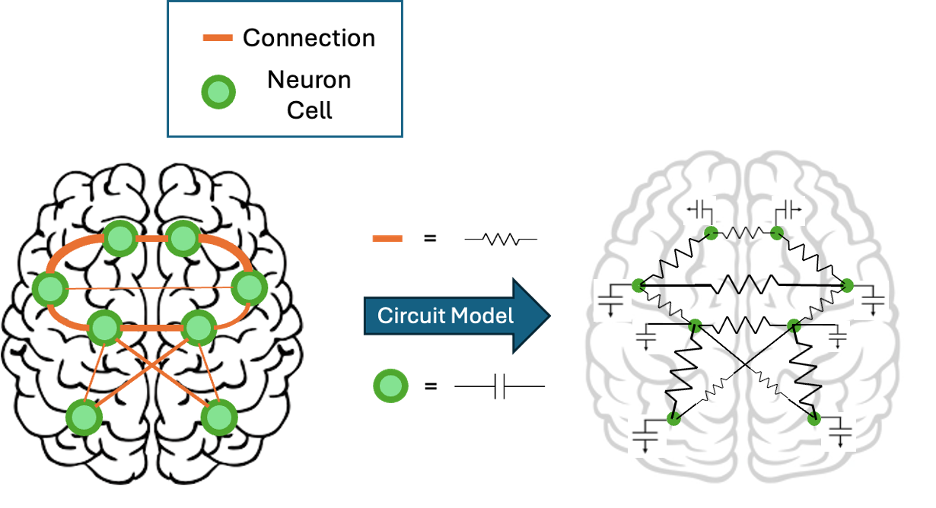

# TMS_RC_Model
This project taken brain structural connectomes as a large resistor capacitor network. The stimulation generated by TMS coils will provide the external charges into certain nodes at beginning. Then we use the electrical equations(KVL) at each node changing with time to build the ODE matrix. In the end we solve this ODEs and get nodes' voltage 

*The resistor-capacitor circuit based on the brain structural connectome network. The green nodes are the targeting brain regions we concerned, and the orange lines stands for the connection between those regions. In order to analyse the signal propagation through such network, we can take brain regions as capacitors and the connections as resistors. Then the brain network is transferred to a resistor-capacitor circuit network which we can use electric circuit knowledge to solve such network.*


## Step 1: TMS E-Field Simulation in SimNIBS

*This section explains how to position the TMS coil in SimNIBS at a specified MNI-space location and run the electric field (E-field) simulation.*

### 1.1 Define MNI Coordinates(Optional if you know the subject coordinates)
In this project we use the empircal TMS-fMRI data provided by Tik's group(Tik, Woletz et al. 2023). 
In their TMS experiments their targeting position is in mni-space with a coordinate: (-42, 28, 21) with an angle of 45 degree against the brain surface.The coil they used is a Figure-8 coil with a diameter of 70mm.


In this project, we use empirical TMS-fMRI data provided by Tik's group (Tik, Woletz et al., 2023). Their experiments target a position in MNI space at coordinates `(-42, 28, 21)`, with the coil positioned at a 45-degree angle against the brain surface. They used a Figure-8 coil with a diameter of 70mm.

- **Target MNI Coordinates**: `(-42, 28, 21)`

> **Note**: If your empirical data includes a different MNI coordinate, substitute it in the above step.  
> If you already know the subject-specific coordinates of the coil, you can skip Step 1.3.

**Software Required**: [SimNIBS](https://simnibs.github.io/simnibs/) (v4.0.0 or later)

### 1.2 Build and Choose the Head Model in SimNIBS (FEM Software)

SimNIBS is an FEM (Finite Element Method) software that simulates the electromagnetic field generated by TMS coils within the brain. For detailed instructions, refer to the [SimNIBS tutorial](https://simnibs.github.io/simnibs/build/html/tutorial/tutorial.html).

**Using a Head Model**: It’s essential to use a compatible head model for accurate simulation results. In this project, we use a pre-built head model provided by SimNIBS, located at:

```shell
/simnibs_examples/ernie/m2m_ernie/
```


### 1.3 Convert MNI to Subject Coordinates
In this step we will convert the mni-space coordinates to the subject ones using the command `mni2subject_coords` in SimNIBs. Use the command `mni2subject_coords -h` or check the SimNIBs website for more details.

Run in your terminal with below commands(make sure you have alread installed the **SimNIBS**):
```shell
mni2subject_coords -m simnibs_examples/ernie/m2m_ernie/ -c -42 28 21  -o subject_TMS_coords.csv
```

The result is written in the `subject_TMS_coords.csv` and in this case the subject coordinates is:  
```shell
(-42.30, 28.12, 53.64)
```


### 1.4 Set the Coil's Coordinate and Angle in SimNIBS
After get the subject coordinate, the next step is set the TMS coil's coordinate and angle in the SimNIBS. The angle we used in this setup is the vector type: `[0 1 0]` in the approximate of the coil angle of 45 degree against the brain surface.


### 1.5 Run the Simulation and Extract the Electric Field

After setting up the TMS coil position and angle, run the simulation in SimNIBS. The output will generate a file (e.g., `ernie_TMS_1-0001_Magstim_70mm_Fig8_nii_scalar.msh`) in your designated output folder. This `.msh` file contains the 3D electric field distribution from the simulation.

In this project, we aim to extract the electric field values specifically on the **white matter surface**. To do this, we’ll use the [HCP S1200 group average surfaces](https://www.humanconnectome.org/study/hcp-young-adult/article/s1200-group-average-data-r...) as a reference surface.

#### Requirements

Before extracting electric field data on the surface map, you need to install the [Connectome Workbench](https://www.humanconnectome.org/software/get-connectome-workbench) software. This provides the `wb_command` utility, which includes the `get_fields_at_coordinates` function we will use.

> **Note**: If you’re on a Mac with an M-series chip, you may encounter compatibility issues with the command-line tools. If possible, use a computer with an Intel chip or a Windows version of Connectome Workbench to ensure functionality.

#### Preparing Coordinates of Interest

To extract the electric field at specific nodes in the structural connectome, use the file `subject_coord_91k.csv`, which contains high-resolution (fs32k) structural connectome nodes in subject space. This CSV file lists the subject coordinates in the same order as the nodes in the structural connectivity matrix.

- **CSV File**: `subject_coord_91k.csv`
- **Uploaded this sample csv file at:**: `/data/subject_coord_91k.csv`

#### Extracting E-Field Values at the Specified Nodes

Use the following command in your terminal to extract the electric field values at the specified coordinates from your simulation output file:

```shell
get_fields_at_coordinates -s <path_to_csv>/subject_coord_91k.csv -m <path_to_simnibs_result>/ernie_TMS_1-0001_Magstim_70mm_Fig8_nii_scalar.msh
```

- Replace `<path_to_csv>` with the directory path to the file `subject_coord_91k.csv` you placed.
- Replace `<path_to_simnibs_result>` with the directory path same as the path you used for your SimNIBS output folder.

After this command you will get a new csv file named `subject_coord_91k_normE.csv` which contains the extracted E-field of the structural connectome network.


## Step 2: Building the RC Circuit in MATLAB

In this step, we model the brain’s structural connectivity as a resistor-capacitor (RC) network. This approach treats brain regions as nodes connected by resistive and capacitive elements, simulating how an initial stimulus (generated by TMS) propagates through the network over time. This step is divided into three different models, each increasing in complexity and resolution:

### 2.1 Toy Model (Five-Node Model)

The toy model provides a simplified version of the RC network, using only five nodes(or any n nodes if you wish). This smaller network allows us to implement and test the basic principles of the RC circuit model and evaluate the effects of TMS-driven stimulation in a manageable setup. Each node represents a distinct "region" with a capacitor connected to the ground and each connection between nodes is treated as a resistor.
**MATLAB Script**: The script for the toy model (`RC_toy.m`) is available in the repository. This script allows users to modify the number of nodes, resistance, and capacitance values to fit your own setup.

### 2.2 Atlas Segmentation Model

The atlas segmentation model uses a standardized brain atlas, in this case we used the [Schaefer 2018](https://github.com/ThomasYeoLab/CBIG/tree/v0.14.3-Update_Yeo2011_Schaefer2018_labelname/stable_projects/brain_parcellation/Schaefer2018_LocalGlobal/Parcellations) atlas map with 1000 cortical regions and 12 subcortex regions involved, to represent brain regions at a more realistic scale than the toy model. Each region in the atlas acts as a node in the network, and connections between regions are weighted according to structural connectivity data. This model provides more anatomical accuracy while still remaining computationally efficient.

### 2.3 High-Resolution (Full-Size Structural Connectome) Model

The high-resolution model employs a full size structural connectome with maximum available detail, representing brain regions at a much finer scale. In our project the original brain map contains 91282 nodes of the cortical and subcortex regions.  Nodes correspond to high-resolution white matter voxels, and connections are based on high-resolution structural connectome data. This model captures a detailed view of TMS signal propagation but it requires significant computational resources for simulation.
> **Note:** Due to the large number of nodes and connections, this model can be memory-intensive(request for 64GB memory for running the code in MATLAB) and require long computation times, we also provided a downsampling method which can downsample the nodes into clusters(e.g., 4x, 8x, or 10x ...). We will discuss this downsampling method in detail later.
---

Each model builds on the previous one, allowing us to gradually scale the RC circuit from a simplified system to a high-resolution network that closely represents the actual brain connectome. In the matlab codes we will introduce the process to build and run those models in detail, please look through each matlab scripts for a better understanding of the models.


